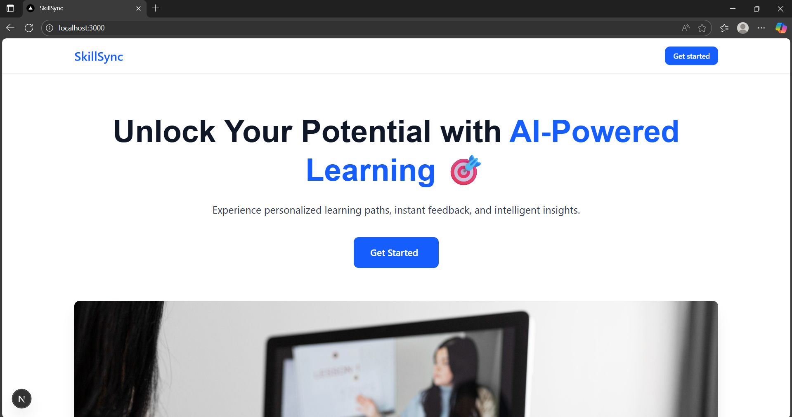
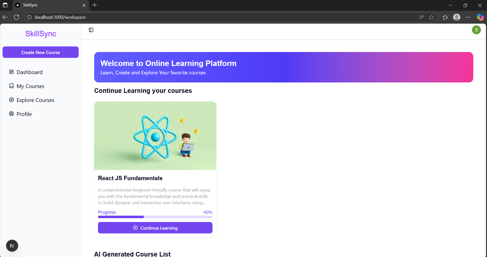
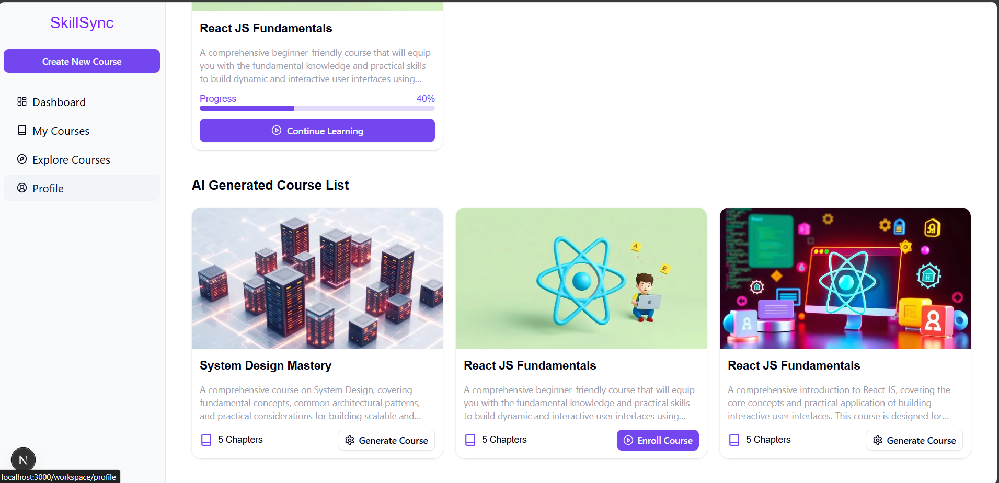
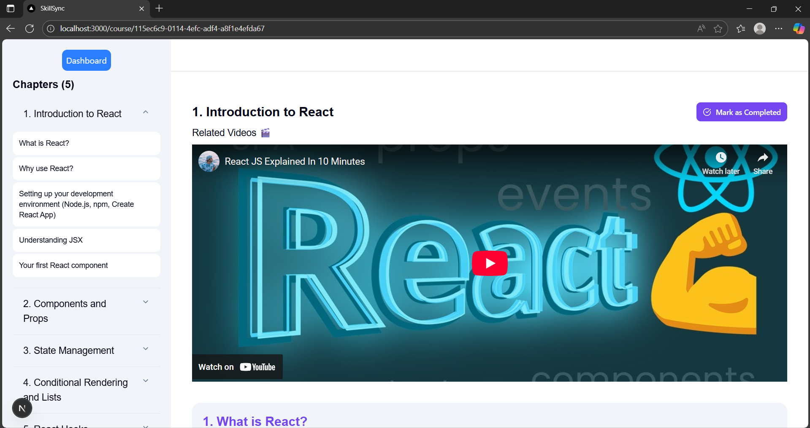

# SkillSync - AI-Powered Learning Platform 🎓

<div align="center">


**Transform your learning experience with AI-powered course creation and personalized education**

[](https://nextjs.org/)
[](https://reactjs.org/)
[](https://tailwindcss.com/)
[](https://clerk.com/)
[](https://ai.google.dev/)

</div>

## 📖 Overview

SkillSync is a modern, AI-powered learning platform that revolutionizes education through intelligent course creation, personalized learning paths, and interactive content generation. Built with cutting-edge technologies, it provides educators and learners with a seamless experience for creating and consuming educational content.

## ✨ Key Features

### 🤖 AI-Powered Course Creation
- **Intelligent Content Generation**: Create comprehensive courses using Google's Generative AI
- **Dynamic Layout Generation**: Automatically structure course content with optimal learning flow
- **Smart Topic Suggestions**: AI-driven recommendations for course topics and structure

### 🎯 Personalized Learning Experience
- **Adaptive Learning Paths**: Tailored content based on individual progress and preferences
- **Interactive Chapters**: Rich multimedia content with videos, text, and interactive elements
- **Progress Tracking**: Real-time monitoring of learning progress and achievements

### 🔐 Secure Authentication
- **Clerk Integration**: Robust user authentication and management
- **Role-based Access**: Separate interfaces for educators and learners
- **Profile Management**: Comprehensive user profile and preference settings

### 📱 Modern User Interface
- **Responsive Design**: Optimized for desktop, tablet, and mobile devices
- **Intuitive Navigation**: Clean, modern interface with smooth interactions
- **Dark/Light Mode**: Customizable theme preferences

## 🖼️ Screenshots

<div align="center">

### Landing Page


### Course Dashboard


### Course Creation Interface


### Learning Experience


</div>

## 🚀 Getting Started

### Prerequisites

- Node.js 18+ 
- npm or yarn
- Google AI API key
- Clerk account for authentication
- Neon Database (PostgreSQL)

### Installation

1. **Clone the repository**
   ```bash
   git clone https://github.com/yourusername/skill-sync.git
   cd skill-sync
   ```

2. **Install dependencies**
   ```bash
   npm install
   # or
   yarn install
   ```

3. **Environment Setup**
   Create a `.env.local` file in the root directory:
   ```env
   # Clerk Authentication
   NEXT_PUBLIC_CLERK_PUBLISHABLE_KEY=your_clerk_publishable_key
   CLERK_SECRET_KEY=your_clerk_secret_key
   
   # Google AI
   GOOGLE_AI_API_KEY=your_google_ai_api_key
   
   # Database
   DATABASE_URL=your_neon_database_url
   
   # Next.js
   NEXT_PUBLIC_CLERK_SIGN_IN_URL=/sign-in
   NEXT_PUBLIC_CLERK_SIGN_UP_URL=/sign-up
   NEXT_PUBLIC_CLERK_AFTER_SIGN_IN_URL=/workspace
   NEXT_PUBLIC_CLERK_AFTER_SIGN_UP_URL=/workspace
   ```

4. **Database Setup**
   ```bash
   # Run database migrations
   npm run db:generate
   npm run db:migrate
   ```

5. **Start the development server**
   ```bash
   npm run dev
   # or
   yarn dev
   ```

6. **Open your browser**
   Navigate to [http://localhost:3000](http://localhost:3000)

## 🛠️ Tech Stack

### Frontend
- **Next.js 15** - React framework with App Router
- **React 18** - UI library
- **Tailwind CSS 4** - Utility-first CSS framework
- **Radix UI** - Accessible component primitives
- **Lucide React** - Beautiful icons

### Backend & APIs
- **Next.js API Routes** - Server-side API endpoints
- **Google Generative AI** - AI content generation
- **Clerk** - Authentication and user management
- **Drizzle ORM** - Type-safe database queries

### Database
- **Neon Database** - Serverless PostgreSQL
- **Drizzle Kit** - Database migrations and schema management

### Development Tools
- **TypeScript** - Type safety
- **ESLint** - Code linting
- **PostCSS** - CSS processing

## 📁 Project Structure

```
SkillSync/
├── app/                    # Next.js App Router
│   ├── (auth)/            # Authentication pages
│   ├── api/               # API routes
│   ├── course/            # Course viewing pages
│   └── workspace/         # Main application
├── components/            # Reusable UI components
├── config/               # Database and schema configuration
├── context/              # React context providers
├── hooks/                # Custom React hooks
├── lib/                  # Utility functions
└── public/               # Static assets
```

## 🎨 Features in Detail

### For Educators
- **Course Creation**: AI-assisted course development with intelligent content suggestions
- **Content Management**: Organize chapters, topics, and multimedia content
- **Student Analytics**: Track student progress and engagement
- **Course Publishing**: Share courses with the learning community

### For Learners
- **Course Discovery**: Browse and enroll in available courses
- **Interactive Learning**: Engage with multimedia content and progress tracking
- **Personal Dashboard**: Monitor learning progress and achievements
- **Profile Management**: Customize learning preferences and settings

## 🔧 API Endpoints

- `POST /api/generate-course-content` - Generate course content using AI
- `POST /api/generate-course-layout` - Create course structure
- `GET /api/courses` - Fetch available courses
- `POST /api/enroll-course` - Enroll in a course
- `GET /api/user` - Get user information

## 🚀 Deployment

### Vercel (Recommended)
1. Connect your GitHub repository to Vercel
2. Configure environment variables in Vercel dashboard
3. Deploy automatically on push to main branch

### Other Platforms
The application can be deployed to any platform that supports Next.js:
- Netlify
- Railway
- DigitalOcean App Platform
- AWS Amplify

## 🤝 Contributing

We welcome contributions! Please follow these steps:

1. Fork the repository
2. Create a feature branch (`git checkout -b feature/amazing-feature`)
3. Commit your changes (`git commit -m 'Add amazing feature'`)
4. Push to the branch (`git push origin feature/amazing-feature`)
5. Open a Pull Request

## 📝 License

This project is licensed under the MIT License - see the [LICENSE](LICENSE) file for details.


